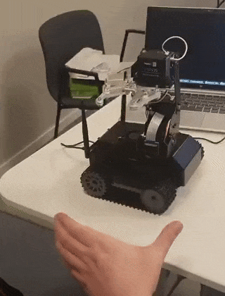

# JETARM

JETANK arm control using Jetson nano and image regression.

Demo: <https://www.youtube.com/watch?v=_AKc48hwebU>



*Figure: Arm control using trained model.*

## Goal

The goal of the project is to control a robot using hand gestures by utilizing AI.
Application: safety, ergonomics.
Examples: working in labs where contamination prevention is critical (test tubes, evidence), working with hot or harmful materials (welding, corrosive), working with heavy objects (construction).

## Requirements

### Hardware

* [Jetson Nano Developer Kit](https://developer.nvidia.com/embedded/jetson-nano-developer-kit).
* [JETANK](https://www.waveshare.com/jetank-ai-kit.htm).

### Software

* [jetbot-043_nano-4gb-jp45](https://github.com/NVIDIA-AI-IOT/jetbot/releases).

## Instructions

### Assembly

* Assemble the JETANK as shown in the official [guide video](https://youtu.be/qNy1hulFk6I).

* Download the [image](https://github.com/NVIDIA-AI-IOT/jetbot/releases) and flash it to the SD card and connect the system to your wireless network. More details on how to do this can be found [here](https://www.waveshare.com/wiki/JETANK_AI_Kit) under the `Setup Guide` tab.

### First Time Setup

* Open the address shown on the oled screen of the JETANK in a web browser using port `8888` .

* Open a new terminal and install the JETANK dependencies by running the commands shown below:

*Note: You can increase the allocated size on the SD card to create more free space. You can also install `ssh` to access the host machine from the Jupyter Lab terminal. See the [Tips](##Tips) section for more details.*

```bash
git clone https://github.com/waveshare/JETANK.git
cd JETANK
chmod +x install.py
chomd +x config.py
./install.sh
./config.sh
```

### Clone the project

Clone the project into the container:

```bash
git clone https://github.com/nizos/jetarm
```

### Collect data

Open the [collect.ipynb](./collect.ipynb) notebook and execute the cells until the `data_collection_widget` is displayed. Collect the data by selecting a category such as `thumb` or `index` and then clicking on the the position of the finger in the camera feed widget. Run the final cell when done to properly close the camera.

Make sure to collect enough images of both the thumb and index finger in different position of the screen and distances from the camera. You can also improve the model by taking photos in different lightning conditions and using different angles. For my demo, a total of 1000 photos were taken for each category.

### Train the model

Open the [tain.ipynb](./tain.ipynb) notebook and execute the cells until the training and evaluation tool is displayed. Set the number of epochs you want to perform and then start the training. Once done, click on the save button to save the model.

By default is model is save to `model_resnet18.pth`. For my demo, a total of 20 epochs were performed.

### Convert the model

Open the [build.ipynb](./build.ipynb) notebook and execute the cells to save the model as `TensorRT`. This notebook will load the `model_resnet18.pth` file from the previous step and save it as `model_trt.pth`.

### Run the demo

Open the [demo.ipynb](./demo.ipynb) notebook and execute the cells until the camera is attached. You can now control the robots arms and movement using hand gestures.

Don't forget to run the remaining cells when you are done so that the camera gets closed properly.

## Tips

The following section describes some operations that have been helpful in developing and running the project.

### SSH into host

You can install `ssh` to access the host machine from the Jupyter Lab terminal.

```bash
apt update
apt install ssh
ssh jetbot@0.0.0.0
```

### Increase Capacity

You can increase the allocated size on the SD card to create more free space by running the following commands:

```bash
cd ~/jetcard
git pull
./scripts/jetson_install_nvresizefs_service.sh
```

## Project

Additional documentation of the project:

* [Robot assembly](./docs/ASSEMBLY.md)
* [Dev diary](./docs/DIARY.md)

## Notes

This project is a submission to the [Jetson AI Certification Program](https://developer.nvidia.com/embedded/learn/jetson-ai-certification-programs).

The project borrows from code that has been made available on the following sources:

* [AJV009/Nvidia_DLI_Getting_Started_with_AI_on_Jetson_Nano](https://github.com/AJV009/Nvidia_DLI_Getting_Started_with_AI_on_Jetson_Nano).
* [waveshare/JETANK](https://github.com/waveshare/JETANK).

## Maintainer

Nizar ([@nizos](https://github.com/nizos))

## License

GPL-3.0 License
