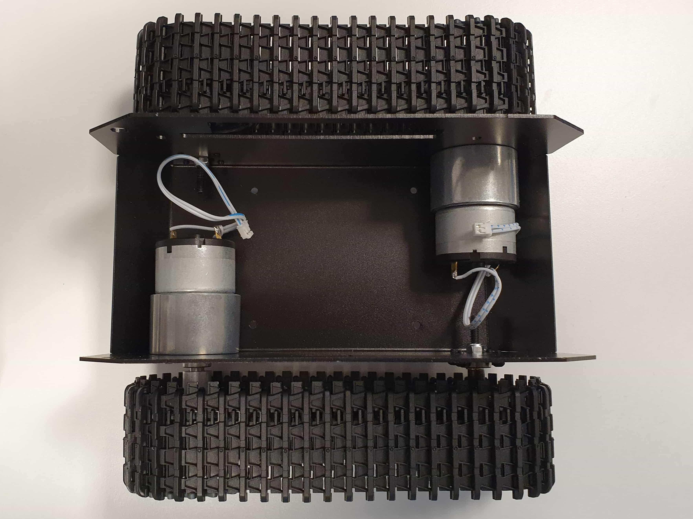
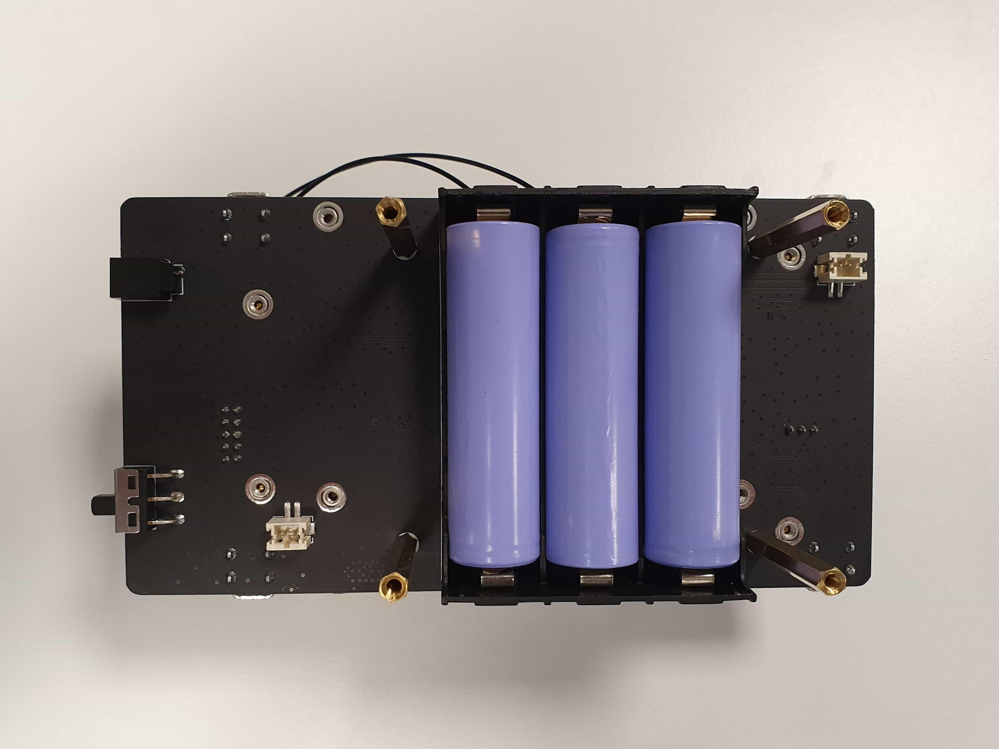
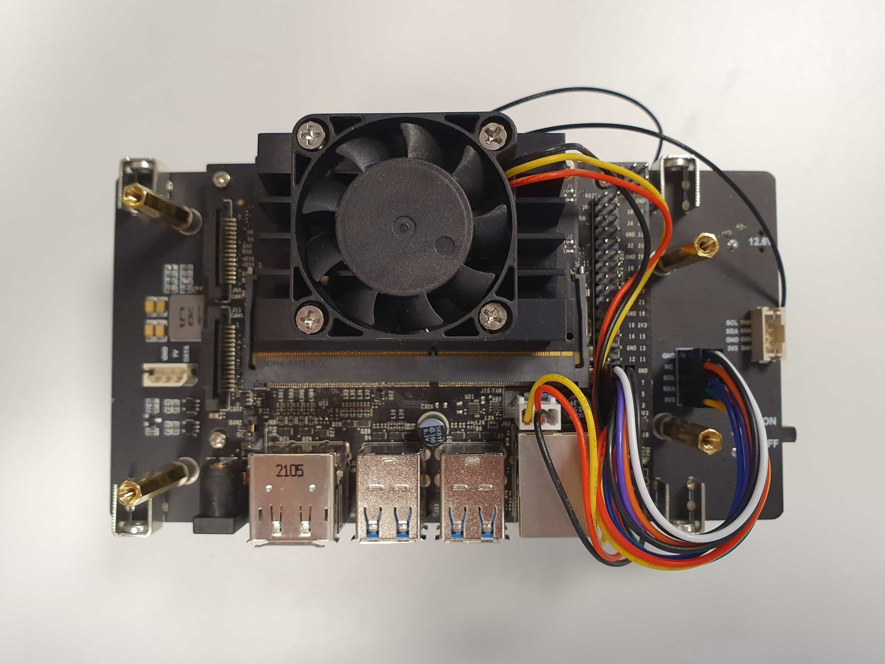
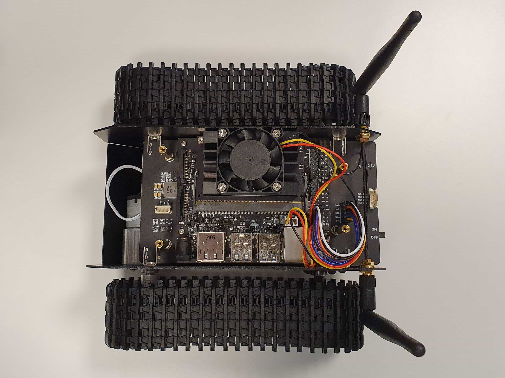
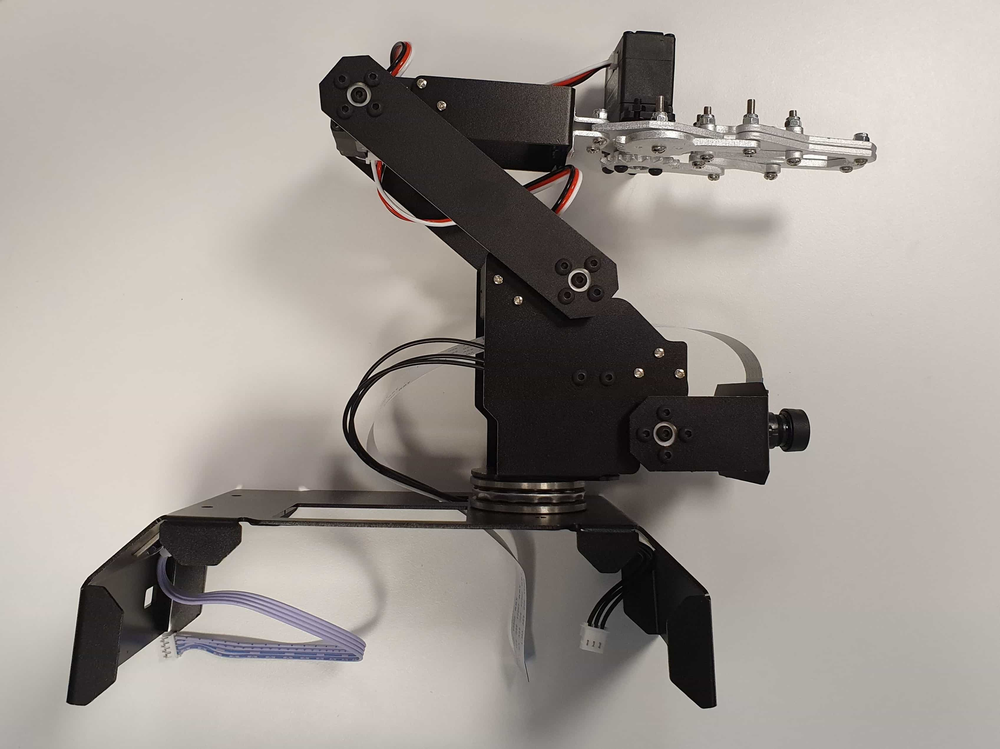
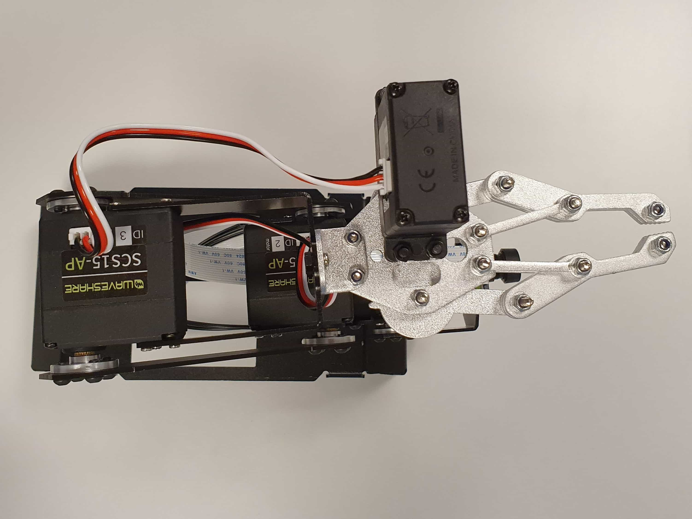
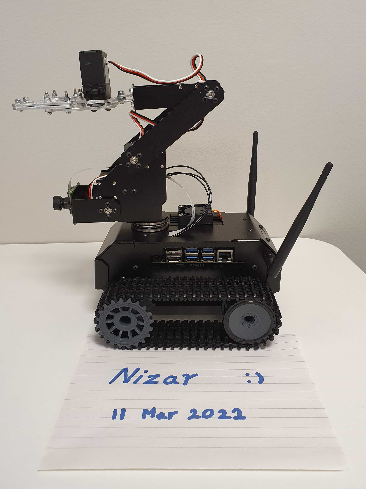
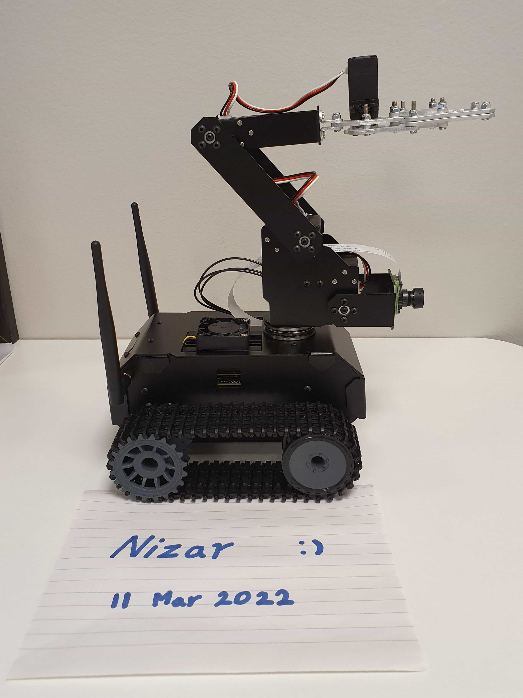
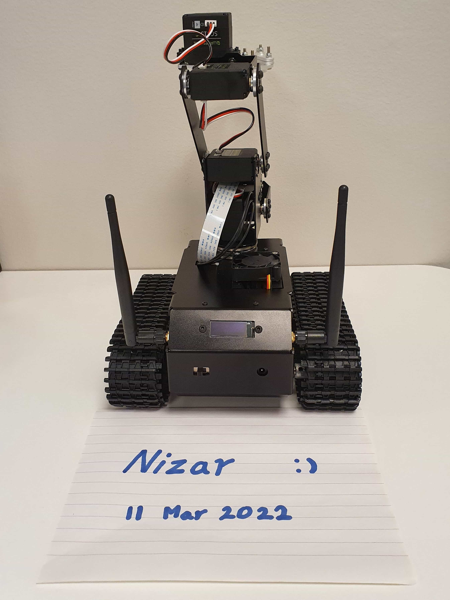
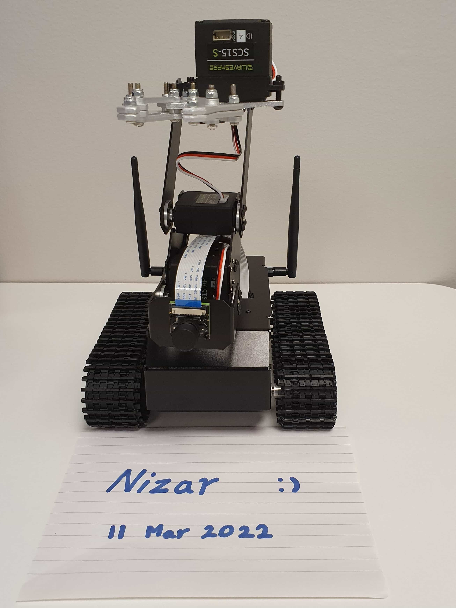

# Assembly

*Figure: Top view of the JETANK hull showing the motors and the rails.*

*Figure: Underside of the JETANK board showing the batteries.*

*Figure: Top view of the JETANK board showing the Jetson Nano with the heatsink, fan, gpio pins, and I/O ports.*

*Figure: Top view of the JETANK with the board fitted along with wifi and bluetooth antennas.*

*Figure: Side view of the robot arm showing the arm and the mounted camera.*

*Figure: Top view of the robot arm showing the clasping mechanism and the wiring.*

*Figure: Left-side view of the fully built robot.*

*Figure: Right-side view of the fully built robot.*

*Figure: Rear-side view of the fully built robot.*

*Figure: Front-side view of the fully built robot.*
