# Dev Diary

## Day 1

Getting started course & image classification.

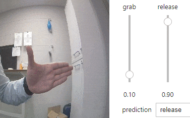

*Figure: Grip gestures using image classification.*

Extended classes for raising and lowering arm.

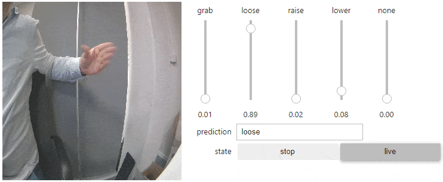

*Figure: Grip and arm gestures using image classification.*

## Day 2

Implemented logic for prototype. Hand grab/loose works fine but horizontal control of arm is challenging and lacks precision.

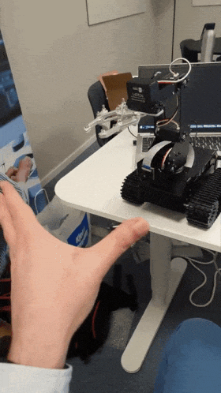

*Figure: Grip control using image classification.*

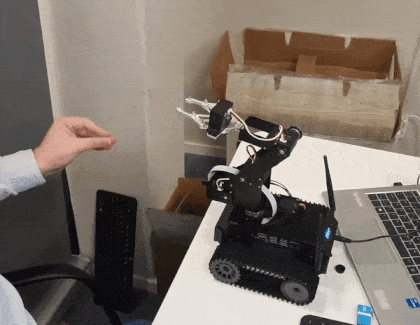

*Figure: Arm control using image classification.*

## Day 3

Switched to image regression for more range control.

Additional points have been added to provide perspective and context such as depth when measuring distance between thumb and fingers. The wrist
and the middle, ring, and pinky finger are used for this purpose.

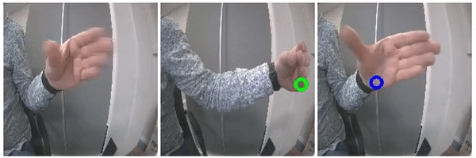

*Figure: Wrist.*

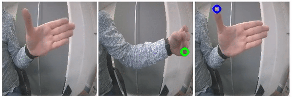

*Figure: Thumb.*

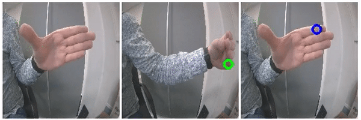

*Figure: Index finger.*

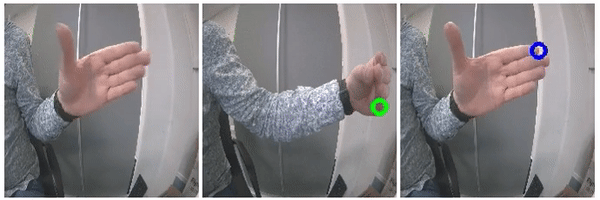

*Figure: Middle.*

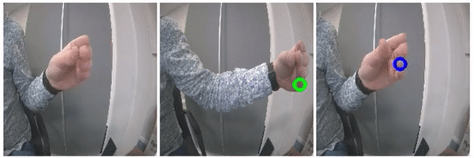

*Figure: Ring finger.*

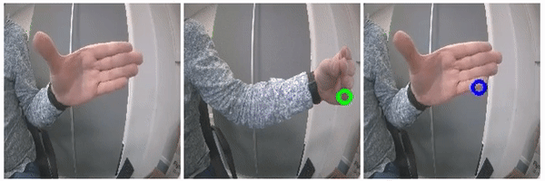

*Figure: Pinky finger.*

## Day 4

Training the model has become more and more time consuming. The dataset has also increased in size which has made the workload even heavier.

As such, the code has been split into separate files and the model has been converted into TensorRT.

This separation of concern and model conversion allows for a more organized project and better performance.

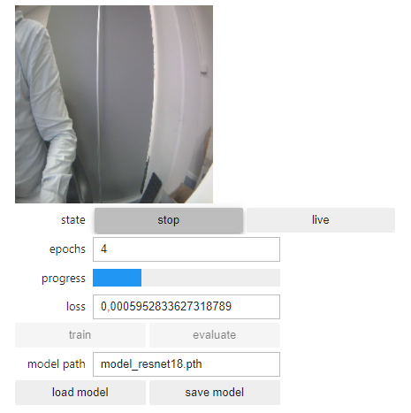

*Figure: Model training.*

## Day 5

Implemented control logic for the image regression-based prototype. Results are promising but more work needs to be done to improve the movement related logic. The path is now set for more training and improvements next week.

*Figure: Grip control using image regression.*

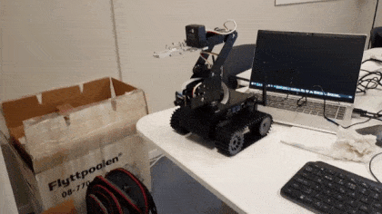

*Figure: Arm control using image regression.*

## Day 6

Documentation, organization & clean-up.

## Day 7

I have decided to simplify the AI model as the previous design added more complexity without the benefit of better results. That is, the model no longer tracks the wrist, middle finger, ring finger, and pinky finger.

The reason they were added in the first place was to allow for more context when interpreting the x and y coordinates of the thumb and the index finger. For example, being able to differentiate between whether the thumb and index finger are relatively close to one another or whether it is the whole hand that is further away from the camera.

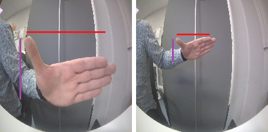

*Figure: Side by side images showing how the distance between the hand and the camera affects the interpretation of the grip width.*

The initial implementation attempted to provide this context by deriving some ratios and comparing them. For example, the distance between the thumb and the index finger was compared to the distance between the thumb and the wrist. The idea here is that the distance between the thumb and the index finger will change just as much in scale as the distance between the thumb and the wrist when moving the hand closer or further away from the camera. As such, this ratio could be used to correct for variations in the distance between the hand and the camera when interpreting the width of the grip. This was however not enough as normal variations in the position of the thumb along with tilting and panning of the hand resulted in disproportional corrections and interpretations.

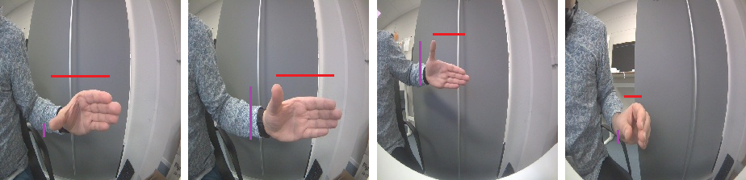

*Figure: Side by side images showing the encountered challenges from using the wrist-thumb distance to adjust for the hand distance to the camera.*

An alternative method that was tested derived the ratio by measuring the distance between the tip of the index finger and the tip of the pinky finger. The reasoning here is that this distance is less prone to variations as long as the fingers are held together. This allowed the thumb to move around freely in the horizontal axis without disproportionally affecting the interpretation of the demonstrated grip width.

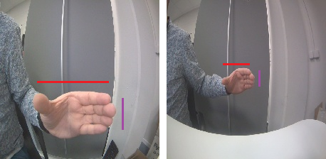

*Figure: Side by side images showing how the distance from the index finger to the pinky finger was used to interpret the grip width at different distances from the camera.*

While this approach provided better results, it still had issues. One such issue is encountered when the hand is tilted forwards or downwards. This threw off the ratio and in turn the interpretation of the grip width.

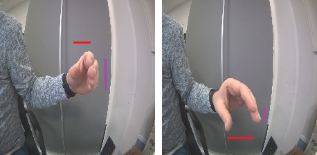

*Figure: Side by side images showing the encountered challenges from using the index-pinky distance to adjust for the hand distance to the camera.*

Another issue that was encountered was caused by the size of the error margins being too large in proportion to the distance between the tip of the index finger and the tip of the pinky finger. This became more noticeable the further away the hand was from the camera which made the grip width interpretation overly sensitive to small movements.

The before-mentioned reasons resulted in the decision to simplify the model as the added complexity did not lead to better results. This decision also resulted in shorter training time and more predictable behavior.

The figure below shows the robot being operated by the simplified design.

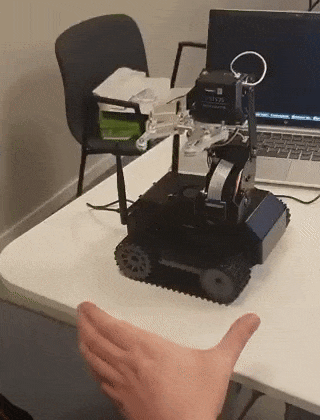

*Figure: Improved grip and arm control using image regression.*

## Day 8

Text.

## Day 9

Text.

## Day 10

Submission day.
